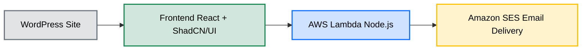

# Rival Labs Quote Generator

## Overview

This project is a dynamic quote generator built for Rival Labs, a supplement company. The tool allows users to configure their custom supplement formulation by selecting ingredients and product details. Once completed, the system generates a quote and sends it via email.

## Features

- **Interactive Form**: Built with React and styled using shadcn components for a modern UI.
- **Dynamic Quote Generation**: Updates pricing and details in real-time as the user selects options.
- **AWS Lambda Backend**: Handles quote generation and email sending.
- **Email Delivery**: Uses Amazon SES to send the generated quote as an HTML email.
- **WordPress Integration**: The form is embedded seamlessly within Rival Labs' existing WordPress site.

## Technologies Used

- **Frontend**: React, ShadCN/UI
- **Backend**: AWS Lambda (Node.js), Amazon SES
- **Hosting & Deployment**: Embedded in WordPress
  


## How It Works

1. **User Selection**: Customers choose ingredients, flavors, and product details.
2. **Real-Time Pricing**: The form dynamically updates to show estimated costs.
3. **Submission**: The completed form is sent to the backend.
4. **Email Generation**: AWS Lambda processes the request and creates an HTML quote.
5. **Delivery**: The quote is emailed to the customer via Amazon SES.

## Installation & Setup

This project is integrated into Rival Labs' WordPress site, so no local setup is required. However, if modifications are needed:

### Clone the Repo (if applicable):

```bash
git clone https://github.com/your-repo/quote-generator.git
cd quote-generator
```

### Install Dependencies:

```bash
npm install
```

### Run Locally:

```bash
npm start
```

### Deploy Backend (AWS Lambda):

- Ensure AWS CLI is configured
- Deploy using Serverless Framework or AWS SAM

## Deployment

- **Frontend**: Integrated as an iframe or directly embedded in WordPress
- **Backend**: Hosted as an AWS Lambda function with an API Gateway endpoint
- **Email Service**: Uses Amazon SES for reliable email delivery

## Future Enhancements

- PDF Quote Generation
- Multi-step Form UX Improvements
- Database Storage for Order History
